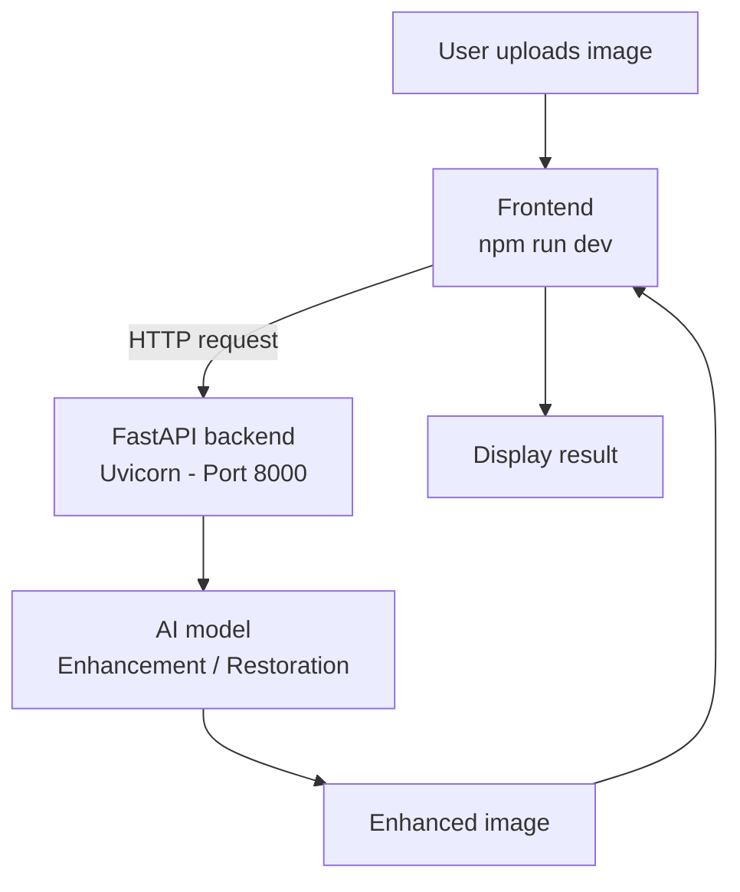
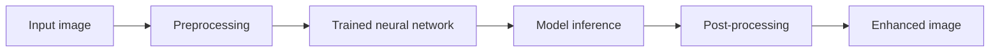

<div align="center">


<br>


<br><br>


</div>

<br>

## 📌 About the project

This project is an **AI-powered image enhancement and restoration system** that improves the visual quality of degraded, noisy, or low-quality images using a trained deep learning model — served end to end through a web app.

```
User Upload → Frontend → FastAPI Backend → AI Model → Enhanced Image → Frontend Result
```

<br>

## ✨ Features

<table>
<tr><td>🖼️</td><td>Upload images through a web interface</td></tr>
<tr><td>🤖</td><td>AI-powered image enhancement</td></tr>
<tr><td>🧠</td><td>Deep learning model inference</td></tr>
<tr><td>⚡</td><td>FastAPI backend</td></tr>
<tr><td>🌐</td><td>Modern frontend interface</td></tr>
<tr><td>📊</td><td>Image-quality evaluation using PSNR and SSIM</td></tr>
<tr><td>🔄</td><td>Real-time communication between frontend and backend</td></tr>
<tr><td>🚀</td><td>Ready for future cloud deployment</td></tr>
</table>

<br>

## 🏗️ System architecture



<br>

## 📁 Project structure

```
project-root/
│
├── backend-code/
│   ├── main.py
│   ├── requirements.txt
│   └── models/
│       └── trained-model.pth
│
├── frontend/
│   ├── package.json
│   ├── src/
│   └── public/
│
├── .gitignore
└── README.md
```

> The exact filenames and directories may vary depending on the implementation.

<br>

## 🧰 Tech stack

<div align="center">


</div>

<br>

## ⚙️ Prerequisites

- Python 3.x
- Node.js
- npm
- Git

```bash
python --version
node --version
npm --version
git --version
```

<br>

## 🚀 Installation

**1. Clone the repository**

```bash
git clone <YOUR_GITHUB_REPOSITORY_URL>
cd <PROJECT_FOLDER>
```

<br>

## 🐍 Backend setup

The backend handles image-processing requests and runs the trained AI model — built with Python, FastAPI, Uvicorn, and deep learning libraries.

**2. Navigate to backend**

```bash
cd backend-code
```

**3. Install dependencies**

```bash
python -m pip install -r requirements.txt
```

**4. Start the server**

```bash
python -m uvicorn main:app --reload --host 127.0.0.1 --port 8000
```

Backend runs at `http://127.0.0.1:8000` · interactive docs at `http://127.0.0.1:8000/docs`

<details>
<summary><strong>Port 8000 already in use?</strong></summary>
<br>

Run the backend on 8001 instead:

```bash
python -m uvicorn main:app --reload --host 127.0.0.1 --port 8001
```

Backend: `http://127.0.0.1:8001` · Docs: `http://127.0.0.1:8001/docs`

> Use either port 8000 or 8001 — you don't need both running at once.

</details>

<br>

## 🎨 Frontend setup

**5. Open a new terminal** (keep the backend running) and navigate to the frontend:

```bash
cd frontend
```

**6. Install dependencies**

```bash
npm install
```

**7. Start the dev server**

```bash
npm run dev
```

The terminal prints the local URL — typically `http://localhost:5173`.

<br>

## ▶️ Run the complete application

<table>
<tr>
<td valign="top" width="50%">

**Terminal 1 — backend**

```bash
cd backend-code
python -m pip install -r requirements.txt
python -m uvicorn main:app --reload --host 127.0.0.1 --port 8000
```

</td>
<td valign="top" width="50%">

**Terminal 2 — frontend**

```bash
cd frontend
npm install
npm run dev
```

</td>
</tr>
</table>

<br>

## 🧠 AI model



The trained model is placed in `backend-code/models/` and may be saved as `.pth`, `.pt`, `.h5`, or `.keras` — the backend must load it with the matching architecture and framework.

<br>

## 📊 Model evaluation

<div align="center">

| Metric | Score | Meaning |
|:---:|:---:|:---|
| **PSNR** | `≈ 25.19 dB` | Higher generally means better reconstruction quality |
| **SSIM** | `≈ 0.713` | Ranges 0 (low similarity) → 1 (very high similarity) |

</div>

Results depend on the dataset, architecture, preprocessing, loss function, learning rate, and augmentation — more epochs helps but doesn't guarantee a target score.

Since restoration isn't a classification task, quality is judged with **PSNR**, **SSIM**, **MSE**, and **LPIPS** — not a single confidence percentage.

<br>

## 🛠️ Troubleshooting

<details>
<summary>Backend does not start</summary>
<br>

```bash
python -m pip install -r requirements.txt
python -m uvicorn main:app --reload --host 127.0.0.1 --port 8000
```

</details>

<details>
<summary>Port 8000 is already in use</summary>
<br>

```bash
python -m uvicorn main:app --reload --host 127.0.0.1 --port 8001
```

Update the frontend's API URL from `http://127.0.0.1:8000` to `http://127.0.0.1:8001`.

</details>

<details>
<summary>ModuleNotFoundError</summary>
<br>

```bash
python -m pip install -r requirements.txt
```

Make sure you're inside `backend-code/` when installing and running.

</details>

<details>
<summary>npm is not recognized</summary>
<br>

```bash
node --version
npm --version
```

If these fail, install Node.js and restart the terminal.

</details>

<details>
<summary>Frontend cannot connect to backend</summary>
<br>

Verify the backend is running at `http://127.0.0.1:8000/docs`, then confirm the frontend is pointed at the correct API URL and port.

</details>

<details>
<summary>Model file not found / fails to load</summary>
<br>

Check that the model exists at `backend-code/models/trained-model.pth` and that the architecture, framework, and save format all match what was used in training.

</details>

<br>

## 🔐 Git & security

Never commit `.env`, API keys, passwords, or access tokens.

```gitignore
.env
.env.*
!.env.example
__pycache__/
venv/
.venv/
node_modules/
dist/
build/
.vscode/
.DS_Store
```

<br>

## 📈 Future improvements

- [ ] Improve training dataset
- [ ] Increase training epochs
- [ ] Tune learning rate
- [ ] Experiment with different architectures
- [ ] Improve PSNR / SSIM
- [ ] Add before/after comparison slider
- [ ] Add batch image enhancement
- [ ] Add model performance dashboard
- [ ] Add CI/CD
- [ ] Deploy frontend and backend
- [ ] Add GPU inference support

<br>

## 👥 Contributors

| Area | Contributor |
|---|---|
| AI / model training | Team member |
| Dataset & evaluation | Team member |
| Backend development | Team member |
| Frontend development | Team member |
| Integration & testing | Team member |

<br>

## ⭐ Project status

<div align="center">


✅ Trained model &nbsp;·&nbsp; ✅ Enhancement pipeline &nbsp;·&nbsp; ✅ FastAPI backend &nbsp;·&nbsp; ✅ Frontend &nbsp;·&nbsp; ✅ PSNR / SSIM eval
<br>
🚧 Production deployment &nbsp;·&nbsp; 🚧 Further model optimization

</div>

<br>

<div align="center">


<sub>Built with deep learning, computer vision, and modern web development.</sub>

</div>
